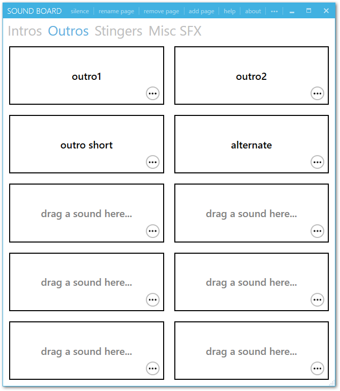
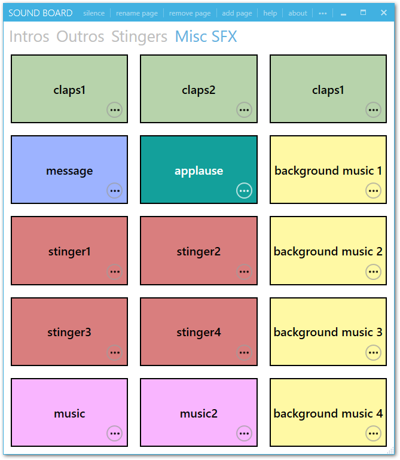
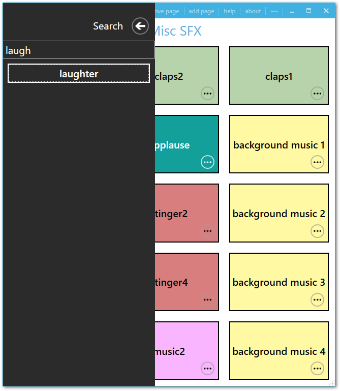
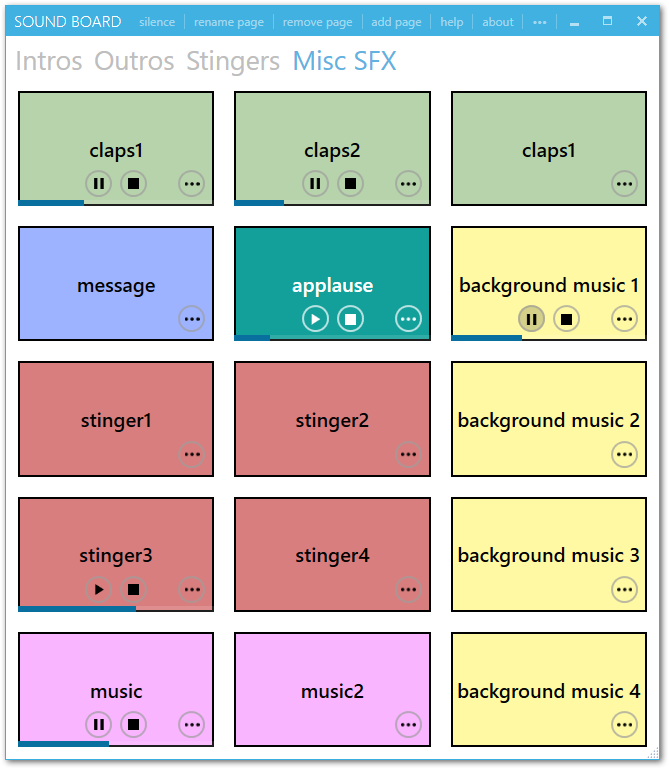
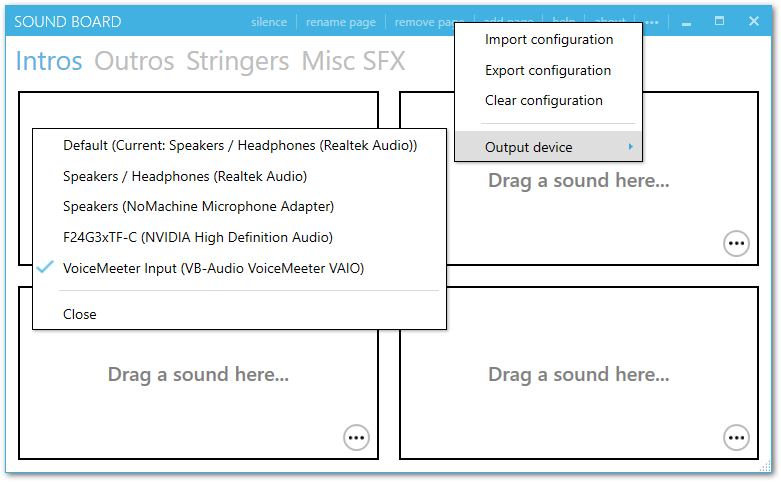
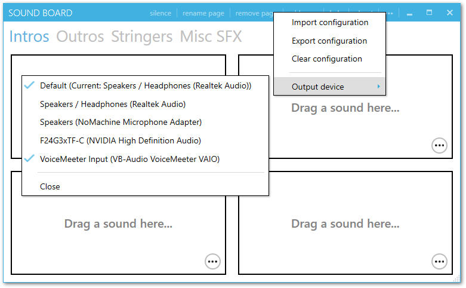
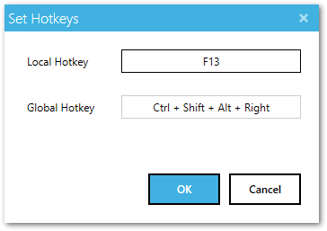

# SoundBoard

## About

SoundBoard is an elegant, easy-to-use application to save and play your favorite sounds.

* Create multiple tabs with sounds in any grid configuration
* Customize the look of each sound by changing the background color
* Set sounds to loop, adjust their volume, trigger other sounds, or stop all other sounds
* Activate sounds via hotkey
* Instantly search and playback sounds by typing their name

## Downloads

Grab the latest version [here](https://github.com/micahmo/SoundBoard/releases/latest/download/SoundBoard.exe). This will download a portable SoundBoard.exe that can be run from anywhere. Use the Export Configuration function to bring your configuration to a different system.

### Requirements

* Windows 10 or 11
* [.NET Framework 4.8](https://dotnet.microsoft.com/download/dotnet-framework/net48) — preinstalled on Windows 10 1903+ and all Windows 11. SoundBoard checks for it at startup and tells you if it is missing.

Nothing is installed: `SoundBoard.exe` is self-contained — every dependency is embedded into the single
executable with [Costura.Fody](https://github.com/Fody/Costura). Your sounds and pages are stored in
`%AppData%\SoundBoard\soundboard.config` (use **Export configuration** to move them to another machine),
and the log is written to `%AppData%\SoundBoard\soundboard.log`. Run it as a normal user: running
elevated breaks drag-and-drop from Explorer, which is why an **ADMIN** marker appears in the title bar
when SoundBoard detects it.

Each release also ships `SoundBoard.exe.sha256`, so you can verify a download:

```powershell
Get-FileHash .\SoundBoard.exe -Algorithm SHA256
```

The app checks for new versions on startup and from **about → Check for updates**; see
[the update manifest documentation](docs/update-manifest.md) for how that works.

## Features

##### Create multiple pages with multiple sounds on each


##### Color-code and customize the number of sounds per page


##### Quickly search and play a sound just by typing


##### View and control playback of each sound individually


##### Select audio output device; allows you to route audio to a device that is not selected as the default in Windows



##### Select multiple audio output devices



> Left-click to select a single audio output device. Right-click to select or unselect additional devices.
>  
> Note that audio playback to multiple output devices is not guaranteed to be 100% synchronized. This functionality is not officially supported by Windows or [NAudio](https://github.com/naudio/NAudio), so SoundBoard is creating separate audio streams to each device which have the potential to drift.

##### Pass through an audio input device

You may also select an input to pipe to your output(s). This is essentially an audio passthrough, and should be roughly equivalent listen feature in the Windows sound properties. You may optionally tweak the desired latency in the configuration file. A too-low latency may result in choppy audio.

##### Assign Hotkeys

You may assign local and global hotkeys to sounds. Pressing a local hotkey will play the corresponding sound when the application is active. Pressing a global hotkey will play the sound regardless of the active window.

* Some shortcuts may be reserved by other apps or by Windows itself.
* Using single letters/number/character hotkeys may conflict with the quick search feature.
* Using standard Windows shortcuts may also produce unintended behavior (e.g., Tab or Win).



## Building from source

SoundBoard is a WPF app on .NET Framework 4.8 built from a classic (non-SDK) `.csproj`. It needs the
full-framework MSBuild that ships with Visual Studio — `dotnet build` does **not** work.

**Prerequisites:** Visual Studio 2019 or newer (any edition, including Community, or Build Tools) with
the **.NET desktop development** workload and the **.NET Framework 4.8 SDK / targeting pack**.

```powershell
git clone https://github.com/micahmo/SoundBoard.git
cd SoundBoard
msbuild SoundBoard.sln /restore /p:Configuration=Release /m
```

The result is a single self-contained `SoundBoard\bin\Release\SoundBoard.exe` — run it directly, or press
F5 in Visual Studio to build and run the `Debug` configuration. Run the tests with `vstest.console.exe`:

```powershell
vstest.console.exe SoundBoard.Tests\bin\Release\SoundBoard.Tests.dll
```

[**BUILDING.md**](BUILDING.md) has the full details: prerequisites, why `dotnet build` fails, the project
layout, CI, and how versioning and releases work. [docs/update-manifest.md](docs/update-manifest.md)
documents the update manifest the in-app updater reads.

## Contributing

Bug reports, feature requests and pull requests are welcome — see [CONTRIBUTING.md](CONTRIBUTING.md)
and the [changelog](CHANGELOG.md).

## License

SoundBoard is licensed under the [MIT License](LICENSE).

The two vendored third-party components are also MIT licensed, with their licenses and a note of the
local changes alongside their source: [Dsafa.WpfColorPicker](Dsafa.WpfColorPicker/LICENSE) and
[HotKeyManagement.WPF](HotKeyManagement.WPF/LICENSE.md).
